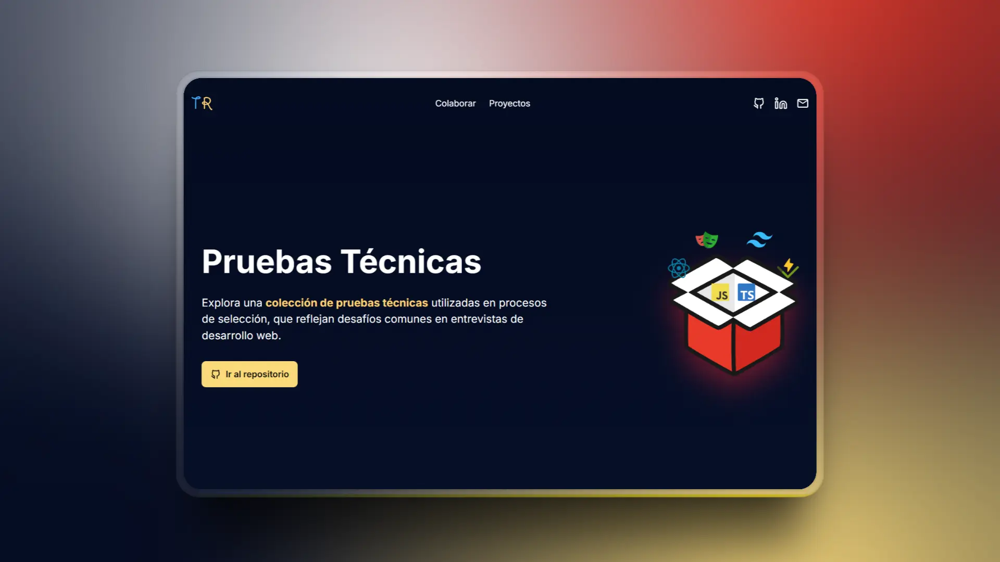

<h1>Pruebas Técnicas</h1>

  Este proyecto es una <strong>landing page</strong> desarrollada como parte del repositorio <a href="https://github.com/anibalcoder/pruebas-tecnicas" title="Ir al repositorio">pruebas-tecnicas</a>, que contiene pruebas técnicas reales para mejorar las habilidades como desarrollador frontend.

