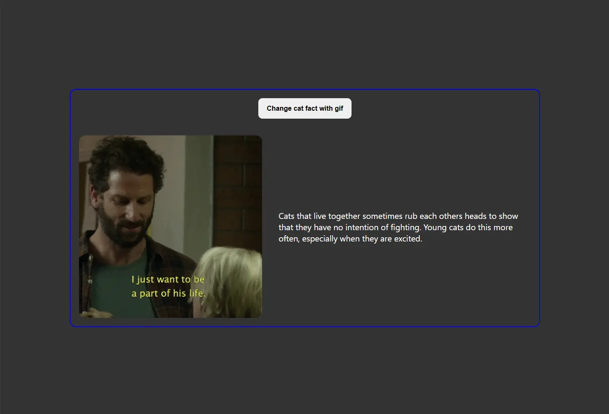
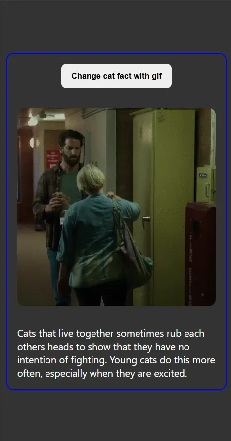

# Cat Facts

> [!NOTE]
> El enunciado de esta prueba técnica fue tomado del [video](https://www.youtube.com/watch?v=Sko0-qSRRfU) de midudev.

## Dadas estas 2 APIs:

- [Cat Random Facts](https://catfact.ninja/fact)
- [Giphy API](https://developers.giphy.com/docs/)

> [!IMPORTANT]
> Copia el archivo `.env.example` y renómbralo como `.env`. Abre el nuevo archivo `.env` y reemplaza el valor de `your_api_key_here` por tu API Key real de Giphy.

## Realizar

1. Selecciona un dato sobre gatos usando la primera API.

2. De ese dato, usa las tres primeras palabras.

3. Y busca un gif usando la API de Giphy.

4. El resultado se tiene que mostrar con una imagen a la izquierda y el texto a la derecha, todo centrado verticalmente.

5. Crea un botón que actualiza el hecho y el gif cada vez que se hace clic.

## Prototipo

- **Desktop**

  

- **Mobile**

  