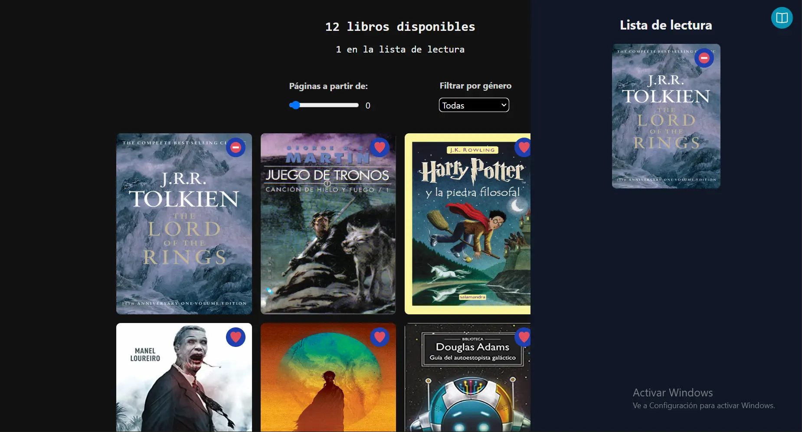
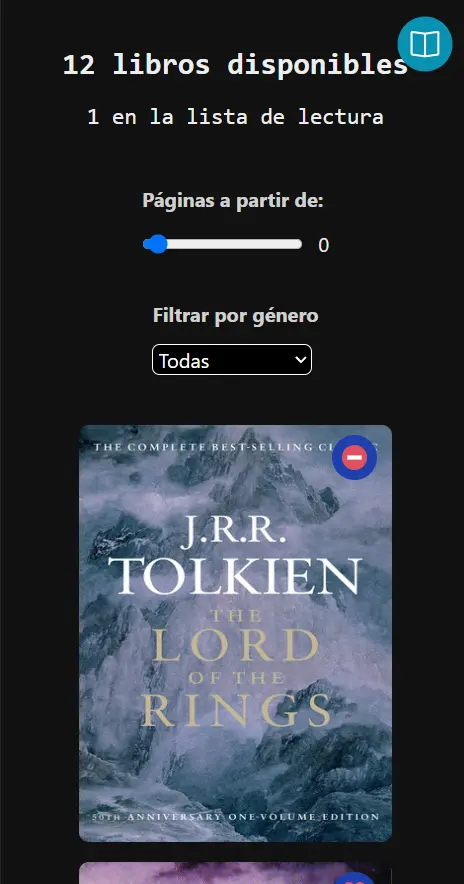

# Lista de lectura

Aplicación para gestionar una lista de libros que deseas leer, permitiéndote añadir o eliminar libros de tus favoritos.

> [!NOTE]
> El enunciado del proyecto está basado en esta [prueba técnica para Juniors](https://github.com/midudev/pruebas-tecnicas/tree/main/pruebas/01-reading-list).

> [!IMPORTANT]
> Los datos de los libros se encuentran en el archivo `./mocks/books.json`.

## ✨ Funcionalidades requeridas

1. **Visualización de Libros**: La aplicación debe mostrar una lista de libros disponibles que el usuario pueda revisar.

2. **Gestión de favoritos**: Añade o elimina libros de tu lista de lectura (favoritos).

3. **Filtrado de Libros**: Permitir filtrar los libros disponibles por **género** y por **número de páginas**.

  - **Género**: Todas, Fantasía, Ficción, Zombies y Terror.
  - **Número de páginas**: Desde 0 hasta 1200.

4. **Sincronización de Estado global**: El estado debe reflejar en todo momento cuántos libros hay en la lista de lectura y cuántos quedan disponibles, actualizándose automáticamente al mover un libro a favoritos.

5. **Persistencia de Datos**: Guardar la lista de favoritos en `localStorage`, de modo que se conserve tras recargar la página.

6. **Diseño responsivo**: La aplicación debe ser accesible en distintos dispositivos, tanto en móvil como en escritorio.

## 🖥️ Prototipo

- **Desktop**

  

- **Mobile**

  