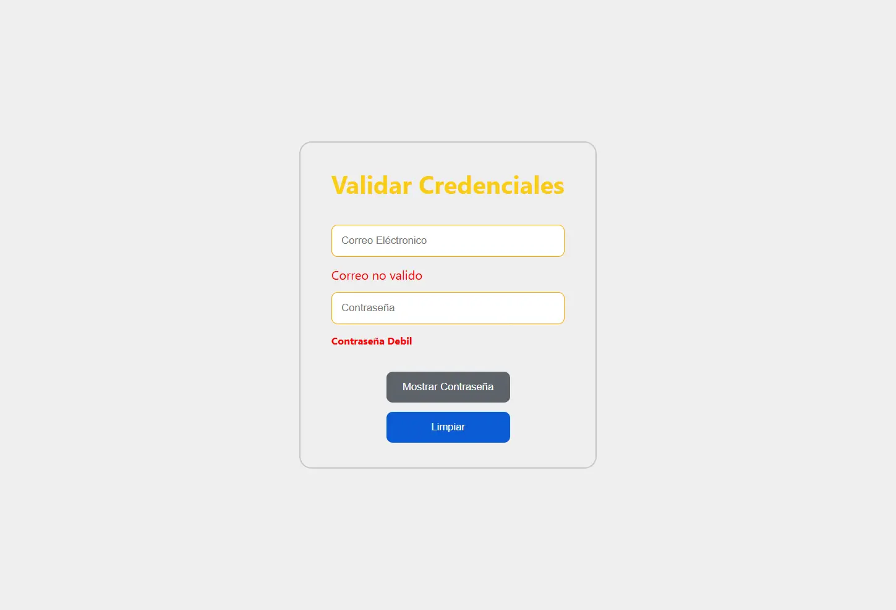

# Contraseña segura

> [!NOTE]
> El enunciado de esta prueba técnica fue tomado del [video](https://www.youtube.com/watch?v=yeHVXQLS2ls) de yosmarcode.

## La aplicación tiene 2 componentes:

- El componente **PageCheckLogin**, que maneja los campos de formulario de la aplicación (Correo Electrónico y Contraseña).
- El componente **PasswordStrength**, que muestra la fortaleza de la contraseña.

## Se espera que una contraseña fuerte tenga todas las siguientes características:

- Una letra mayúscula.
- Una letra minúscula.
- Un número.
- Un carácter especial (`$ @ % * & _`).
- Longitud mayor o igual a 8.

> [!IMPORTANT]
> Se espera que el correo ingresado sea válido como correo electrónico, es decir, que tenga el formato `texto@ejemplo.com`.

## El componente `PageCheckLogin` tiene las siguientes funcionalidades:

- El campo de entrada toma un texto para calcular la fortaleza de la contraseña.

- El campo de entrada debe estar inicialmente vacío y el texto ingresado debe estar oculto.

- El botón **Mostrar Contraseña**, al hacer clic, debe tener las siguientes funcionalidades:

  - El texto del botón debe cambiar a **Ocultar Contraseña** y el campo de entrada debe mostrar el valor de la contraseña ingresada.

  - Al hacer clic nuevamente en el botón, el texto del botón debe cambiar a **Mostrar Contraseña** y el texto ingresado debe estar oculto.

- El botón **Limpiar Datos**, al hacer clic, debe limpiar el campo de entrada.

## El componente `PasswordStrength` tiene las siguientes funcionalidades:

La fortaleza de la contraseña debe ser calculada. El texto correspondiente y el color de fondo deben aplicarse según las siguientes reglas:

| Características Cumplidas | Texto               | Color de Fondo |
| :-----------------------: | :-----------------: | :------------: |
| Menor o igual a 2         | Contraseña Débil    | rojo           |
| Menor o igual a 4         | Contraseña Moderada | naranja        |
| Igual a 5                 | Contraseña Fuerte   | verde          |

## Prototipo

- **Desktop**

  