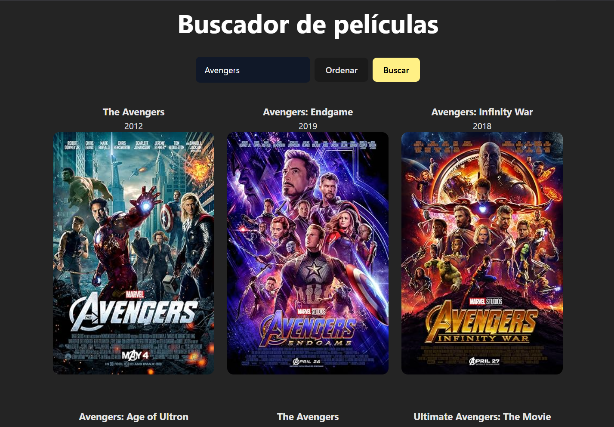
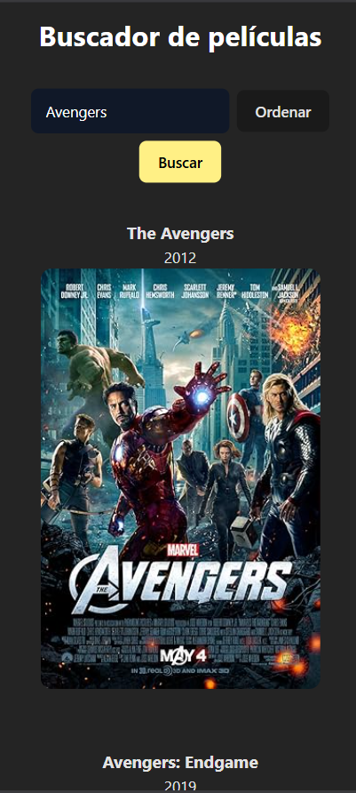

# Buscador de películas

> [!NOTE]
> El enunciado de esta prueba técnica fue tomado del [video](https://www.youtube.com/watch?v=GOEiMwDJ3lc&list=PLUofhDIg_38q4D0xNWp7FEHOTcZhjWJ29&index=5) de midudev.

## Enunciado

Crea una aplicación para buscar películas

API a usar ( [https://www.omdbapi.com/](https://www.omdbapi.com/) ) - Consigue la API Key en la propia página web registrando tu email.

### Requerimientos

1. Necesita mostrar un input para buscar la película y un botón para buscar.
2. Lista las películas y muestra el título, año y poster.
3. Que el formulario funcione.
4. Haz que las películas se muestren en un grid responsive.
5. Hacer el fetching de datos a la API.

### Primera iteración

1. Evitar que se haga la misma búsqueda dos veces seguidas.
2. Haz que la búsqueda se haga automáticamente al escribir.
3. Evita que se haga la búsqueda continuamente al escribir (debounce).

### Segunda iteración

1. Reglas de búsqueda:
    - **Búsqueda vacías**
        
        👉 Mostrar mensaje: *“No se puede buscar una película vacía”*
        
    - **Búsqueda inexistente**
        
        👉 Mostrar mensaje: *“No se encontraron películas para esta búsqueda”*
        
    - **Menos de 3 caracteres**
        
        👉 Mostrar mensaje: *“La búsqueda debe tener al menos 3 caracteres”*
        
    - **Comienza con número**
        
        👉 Mostrar mensaje: *“No se puede buscar una película con un número”*
        
2. Crear un botón con la etiqueta **“Ordenar”** que permita organizar las películas en orden alfabético**.**

### Prototipo

- **Desktop**
    
    
    
- **Mobile**
    
    