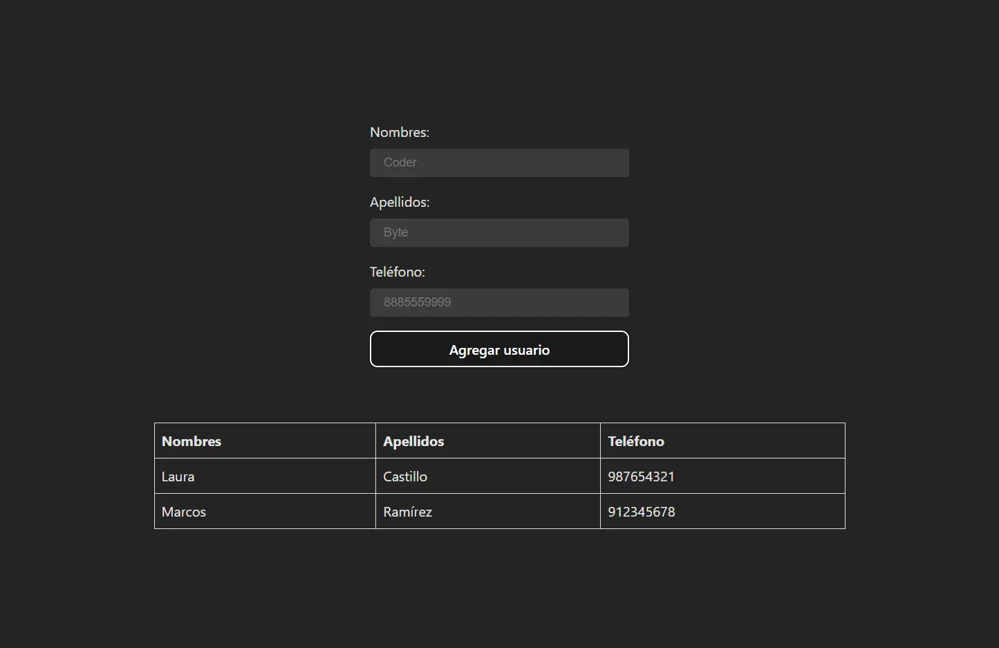

# 📞 Agenda Telefónica en React

> [!NOTE]
> El enunciado de esta prueba técnica fue tomado del [video](https://youtu.be/Lv975nx-BUA?si=Hz3ED5ER7G7HoVwd&t=3922) de **The Fullstack Devs**.

## 🎯 Objetivo

Desarrollar una aplicación en React que funcione como una agenda telefónica básica, donde el usuario pueda agregar contactos a una lista ordenada alfabéticamente por apellido.

## 🧩 Requisitos

1. Crear un formulario en la parte superior con los siguientes campos:

    - Nombre (`first name`)

    - Apellido (`last name`)

    - Teléfono (`phone`)

    - Botón de envío (`submit`)

2. Al presionar el botón de envío:

    - Los datos ingresados deben agregarse a una lista mostrada debajo.

    - La lista debe estar **ordenada automáticamente por apellido**.

    - Los contactos anteriores deben **mantenerse** (no sobrescribirse).

3. Al iniciar la aplicación:

    - Los campos del formulario deben estar **prellenados** con los siguientes valores:

      ```js
      First name = Coder
      Last name  = Byte
      Phone      = 8885559999
      ```

4. Puedes agregar **clases y estilos personalizados**

    > [!TIP]
    > Puedes mantener los estilos predeterminados que genera Vite para ahorrar tiempo y centrarte en la lógica y la estructura del código.

## 🎨 Prototipo


